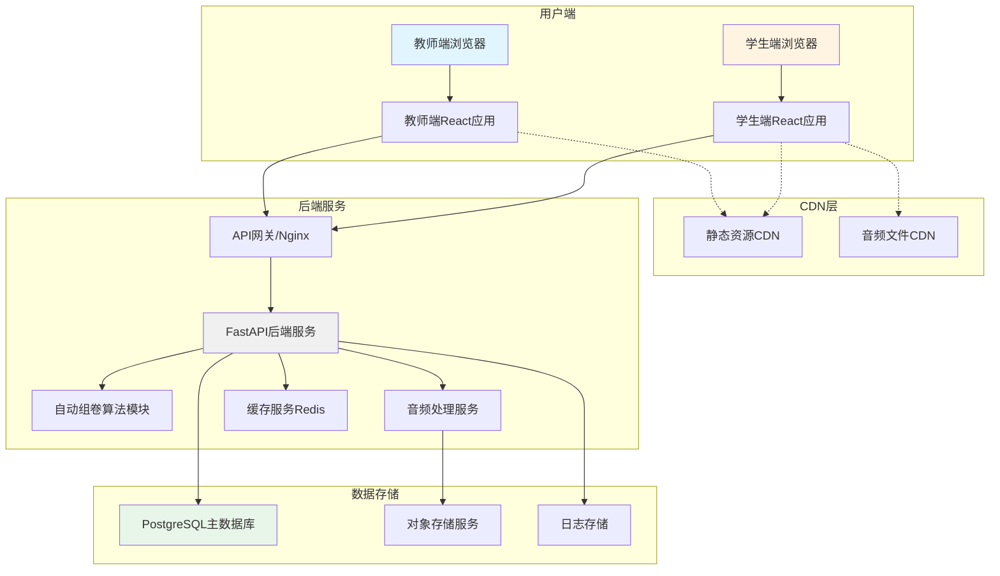
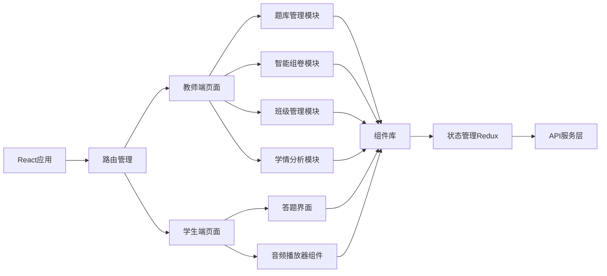
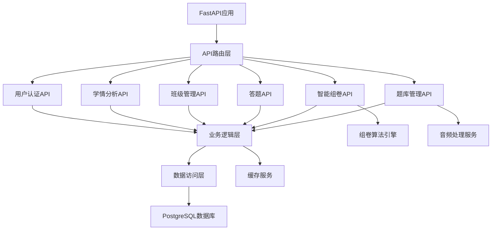

# 小学英语智慧试卷平台 - 技术设计文档

Feature Name: primary-english-smart-exam-platform
Updated: 2026-02-03

## 描述

小学英语智慧试卷平台是一个基于Web的全栈应用，为人教版小学3-6年级英语教师提供题库管理、智能组卷、在线答题和学情分析功能。系统采用前后端分离架构，支持多题型（单选题、听力题、阅读题），集成音频处理能力，并提供符合小学审美和操作习惯的用户界面。

## 架构

### 整体架构图



### 前端架构



### 后端架构



## 组件和接口

### 前端组件

#### 教师端组件

| 组件名称 | 功能描述 | Props | State |
|---------|---------|-------|-------|
| `QuestionEditor` | 题目录入编辑器 | `question: Object`, `onSave: Function` | `editing: Boolean`, `preview: Boolean` |
| `QuestionList` | 题目列表展示与筛选 | `questions: Array`, `filters: Object` | `selectedQuestions: Set`, `loading: Boolean` |
| `AutoPaperGenerator` | 自动组卷配置界面 | `onGenerate: Function` | `config: Object`, `generating: Boolean` |
| `ManualPaperEditor` | 手动组卷编辑器 | `paper: Object`, `onUpdate: Function` | `dragging: Boolean`, `questions: Array` |
| `ClassDashboard` | 班级管理仪表盘 | `classId: String` | `students: Array`, `progress: Object` |
| `AnalysisReport` | 学情分析报表 | `paperId: String`, `classId: String` | `chartData: Object`, `loading: Boolean` |

#### 学生端组件

| 组件名称 | 功能描述 | Props | State |
|---------|---------|-------|-------|
| `ExamView` | 答题主界面 | `paper: Object`, `studentId: String` | `currentQuestion: Number`, `answers: Object` |
| `QuestionCard` | 单个题目卡片 | `question: Object`, `index: Number` | `selectedAnswer: String`, `showFeedback: Boolean` |
| `AudioPlayer` | 音频播放器 | `audioUrl: String`, `autoPlay: Boolean` | `playing: Boolean`, `progress: Number`, `currentTime: Number` |
| `ProgressBar` | 答题进度条 | `current: Number`, `total: Number` | - |
| `ResultView` | 答题结果展示 | `result: Object` | `expanded: Boolean` |

### 后端API接口

#### 题库管理API

```python
# 创建题目
POST /api/questions
Request Body:
{
    "type": "single_choice|listening|reading",
    "grade": 3|4|5|6,
    "unit": 1-12,
    "difficulty": "easy|medium|hard",
    "content": "题目文本",
    "options": ["A", "B", "C", "D"],
    "correct_answer": "A",
    "audio_file": "文件ID",  # 仅听力题
    "reading_material": "阅读材料",  # 仅阅读题
    "knowledge_points": ["词汇", "语法"],
    "tags": ["动词", "时态"]
}
Response:
{
    "question_id": "uuid",
    "created_at": "timestamp"
}

# 查询题目列表
GET /api/questions
Query Params: grade, unit, type, difficulty, keyword, page, page_size
Response:
{
    "total": 100,
    "page": 1,
    "page_size": 20,
    "questions": [...]
}

# 更新题目
PUT /api/questions/{question_id}

# 删除题目
DELETE /api/questions/{question_id}
```

#### 智能组卷API

```python
# 自动组卷
POST /api/papers/auto-generate
Request Body:
{
    "grade_range": [3, 4],
    "unit_range": [1, 6],
    "total_score": 100,
    "question_distribution": {
        "single_choice": 60,
        "listening": 30,
        "reading": 10
    },
    "difficulty_distribution": {
        "easy": 0.3,
        "medium": 0.5,
        "hard": 0.2
    }
}
Response:
{
    "paper_id": "uuid",
    "questions": [...],
    "statistics": {
        "total_score": 100,
        "question_count": 50,
        "distribution": {...}
    }
}

# 手动组卷
POST /api/papers
Request Body:
{
    "name": "期中测试卷",
    "grade": 3,
    "question_ids": ["uuid1", "uuid2", ...]
}

# 发布试卷到班级
POST /api/papers/{paper_id}/publish
Request Body:
{
    "class_id": "uuid",
    "deadline": "timestamp"
}
Response:
{
    "exam_links": [
        {
            "student_id": "uuid",
            "exam_url": "https://domain.com/exam/{token}",
            "qr_code": "base64"
        }
    ]
}
```

#### 答题API

```python
# 获取试卷内容
GET /api/exam/{exam_token}
Response:
{
    "paper_id": "uuid",
    "student_name": "张三",
    "questions": [...],
    "deadline": "timestamp",
    "duration": 3600  # 秒
}

# 提交答案
POST /api/exam/{exam_token}/submit
Request Body:
{
    "answers": {
        "question_id_1": "A",
        "question_id_2": "B",
        ...
    },
    "time_spent": 1800  # 秒
}
Response:
{
    "score": 85,
    "correct_count": 42,
    "total_count": 50,
    "details": [...]
}

# 保存答题进度
POST /api/exam/{exam_token}/save-progress
Request Body:
{
    "answers": {...},
    "current_question": 5
}
```

#### 班级管理API

```python
# 创建班级
POST /api/classes
Request Body:
{
    "name": "三年级1班",
    "grade": 3
}

# 添加学生
POST /api/classes/{class_id}/students
Request Body:
{
    "students": [
        {"name": "张三", "student_number": "2023001"},
        {"name": "李四", "student_number": "2023002"}
    ]
}

# 查看班级答题进度
GET /api/classes/{class_id}/exam-progress/{paper_id}
Response:
{
    "total_students": 40,
    "submitted": 35,
    "pending": 5,
    "students": [
        {
            "student_id": "uuid",
            "name": "张三",
            "status": "submitted",
            "score": 85,
            "submitted_at": "timestamp"
        }
    ]
}
```

#### 学情分析API

```python
# 获取学情报表
GET /api/analysis/{paper_id}/{class_id}
Response:
{
    "statistics": {
        "highest_score": 98,
        "lowest_score": 45,
        "average_score": 76.5,
        "pass_rate": 0.85,
        "excellent_rate": 0.40
    },
    "score_distribution": {
        "90-100": 5,
        "80-89": 12,
        "70-79": 15,
        "60-69": 8,
        "0-59": 5
    },
    "question_analysis": [
        {
            "question_id": "uuid",
            "question_content": "题目内容",
            "correct_rate": 0.75,
            "wrong_count": 10,
            "common_wrong_answers": ["B", "C"]
        }
    ]
}

# 导出Excel报告
GET /api/analysis/{paper_id}/{class_id}/export
Response: File (application/vnd.openxmlformats-officedocument.spreadsheetml.sheet)
```

## 数据模型

### 数据库表结构

#### 用户表 (users)

```sql
CREATE TABLE users (
    id UUID PRIMARY KEY DEFAULT gen_random_uuid(),
    username VARCHAR(50) UNIQUE NOT NULL,
    password_hash VARCHAR(255) NOT NULL,
    role VARCHAR(20) NOT NULL CHECK (role IN ('teacher', 'student')),
    name VARCHAR(50) NOT NULL,
    email VARCHAR(100),
    phone VARCHAR(20),
    created_at TIMESTAMP DEFAULT CURRENT_TIMESTAMP,
    updated_at TIMESTAMP DEFAULT CURRENT_TIMESTAMP
);

CREATE INDEX idx_users_username ON users(username);
CREATE INDEX idx_users_role ON users(role);
```

#### 班级表 (classes)

```sql
CREATE TABLE classes (
    id UUID PRIMARY KEY DEFAULT gen_random_uuid(),
    name VARCHAR(50) NOT NULL,
    grade INTEGER NOT NULL CHECK (grade IN (3, 4, 5, 6)),
    teacher_id UUID REFERENCES users(id) ON DELETE CASCADE,
    created_at TIMESTAMP DEFAULT CURRENT_TIMESTAMP
);

CREATE INDEX idx_classes_teacher ON classes(teacher_id);
CREATE INDEX idx_classes_grade ON classes(grade);
```

#### 学生表 (students)

```sql
CREATE TABLE students (
    id UUID PRIMARY KEY DEFAULT gen_random_uuid(),
    user_id UUID REFERENCES users(id) ON DELETE CASCADE,
    class_id UUID REFERENCES classes(id) ON DELETE SET NULL,
    student_number VARCHAR(20) UNIQUE NOT NULL,
    name VARCHAR(50) NOT NULL,
    created_at TIMESTAMP DEFAULT CURRENT_TIMESTAMP
);

CREATE INDEX idx_students_class ON students(class_id);
CREATE INDEX idx_students_number ON students(student_number);
```

#### 题目表 (questions)

```sql
CREATE TABLE questions (
    id UUID PRIMARY KEY DEFAULT gen_random_uuid(),
    type VARCHAR(20) NOT NULL CHECK (type IN ('single_choice', 'listening', 'reading')),
    grade INTEGER NOT NULL CHECK (grade IN (3, 4, 5, 6)),
    unit INTEGER NOT NULL CHECK (unit >= 1 AND unit <= 12),
    difficulty VARCHAR(10) NOT NULL CHECK (difficulty IN ('easy', 'medium', 'hard')),
    content TEXT NOT NULL,
    options JSONB,  -- 单选题选项: ["A. xxx", "B. xxx", ...]
    correct_answer VARCHAR(10) NOT NULL,
    audio_file_id VARCHAR(255),  -- 听力题音频文件ID
    reading_material TEXT,  -- 阅读题材料
    knowledge_points TEXT[],  -- 知识点标签
    tags TEXT[],  -- 自定义标签
    score INTEGER DEFAULT 2,  -- 题目分值
    created_by UUID REFERENCES users(id),
    created_at TIMESTAMP DEFAULT CURRENT_TIMESTAMP,
    updated_at TIMESTAMP DEFAULT CURRENT_TIMESTAMP
);

CREATE INDEX idx_questions_grade ON questions(grade);
CREATE INDEX idx_questions_unit ON questions(unit);
CREATE INDEX idx_questions_type ON questions(type);
CREATE INDEX idx_questions_difficulty ON questions(difficulty);
CREATE INDEX idx_questions_points ON questions USING GIN(knowledge_points);
CREATE INDEX idx_questions_tags ON questions USING GIN(tags);
```

#### 试卷表 (papers)

```sql
CREATE TABLE papers (
    id UUID PRIMARY KEY DEFAULT gen_random_uuid(),
    name VARCHAR(100) NOT NULL,
    description TEXT,
    grade INTEGER NOT NULL,
    total_score INTEGER NOT NULL,
    question_count INTEGER NOT NULL,
    is_auto_generated BOOLEAN DEFAULT FALSE,
    generation_config JSONB,  -- 组卷配置参数
    created_by UUID REFERENCES users(id),
    created_at TIMESTAMP DEFAULT CURRENT_TIMESTAMP
);

CREATE INDEX idx_papers_grade ON papers(grade);
CREATE INDEX idx_papers_creator ON papers(created_by);
```

#### 试卷题目关联表 (paper_questions)

```sql
CREATE TABLE paper_questions (
    id UUID PRIMARY KEY DEFAULT gen_random_uuid(),
    paper_id UUID REFERENCES papers(id) ON DELETE CASCADE,
    question_id UUID REFERENCES questions(id) ON DELETE RESTRICT,
    question_order INTEGER NOT NULL,
    UNIQUE(paper_id, question_order)
);

CREATE INDEX idx_paper_questions_paper ON paper_questions(paper_id);
CREATE INDEX idx_paper_questions_order ON paper_questions(question_order);
```

#### 考试表 (exams)

```sql
CREATE TABLE exams (
    id UUID PRIMARY KEY DEFAULT gen_random_uuid(),
    paper_id UUID REFERENCES papers(id) ON DELETE CASCADE,
    class_id UUID REFERENCES classes(id) ON DELETE CASCADE,
    name VARCHAR(100) NOT NULL,
    deadline TIMESTAMP NOT NULL,
    duration INTEGER,  -- 考试时长（秒），NULL表示不限制
    created_by UUID REFERENCES users(id),
    created_at TIMESTAMP DEFAULT CURRENT_TIMESTAMP
);

CREATE INDEX idx_exams_class ON exams(class_id);
CREATE INDEX idx_exams_deadline ON exams(deadline);
```

#### 学生考试表 (student_exams)

```sql
CREATE TABLE student_exams (
    id UUID PRIMARY KEY DEFAULT gen_random_uuid(),
    exam_id UUID REFERENCES exams(id) ON DELETE CASCADE,
    student_id UUID REFERENCES students(id) ON DELETE CASCADE,
    exam_token VARCHAR(64) UNIQUE NOT NULL,  -- 答题URL中的token
    answers JSONB,  -- 学生答案: {"question_id": "answer"}
    score DECIMAL(5, 2),
    time_spent INTEGER,  -- 答题耗时（秒）
    status VARCHAR(20) NOT NULL DEFAULT 'pending' CHECK (status IN ('pending', 'in_progress', 'submitted', 'overdue')),
    submitted_at TIMESTAMP,
    created_at TIMESTAMP DEFAULT CURRENT_TIMESTAMP
);

CREATE INDEX idx_student_exams_exam ON student_exams(exam_id);
CREATE INDEX idx_student_exams_student ON student_exams(student_id);
CREATE INDEX idx_student_exams_token ON student_exams(exam_token);
CREATE INDEX idx_student_exams_status ON student_exams(status);
```

### 对象存储结构

```
/audio-files/
    /{year}/{month}/
        {file_hash}.mp3  # 文件名使用哈希值避免重复
        {file_hash}.wav

/exports/
    /reports/
        {class_id}_{paper_id}_{timestamp}.xlsx
```

## 正确性属性

### 题库管理

- **唯一性约束**：同一个教师不能创建完全相同的题目（content + type + options）
- **数据完整性**：听力题必须关联有效的音频文件ID
- **引用完整性**：删除用户时，级联删除该用户创建的题目
- **分值一致性**：试卷总分必须等于所有题目分值之和

### 智能组卷

- **数量匹配**：自动组卷生成的题目数量必须符合配置要求
- **题型占比**：各题型的实际分值占比与配置偏差不超过5%
- **难度分布**：各难度级别的题目数量与配置偏差不超过2题
- **不重复抽取**：同一题目不能在同一张试卷中出现多次

### 在线答题

- **URL唯一性**：每个学生的考试token必须全局唯一
- **答案验证**：提交的答案必须与题目选项匹配
- **完整性检查**：提交试卷时所有题目必须有答案（除非允许跳过）
- **时间限制**：超过deadline的提交应被标记为逾期

### 学情分析

- **分值计算**：客观题得分 = 正确题目分值之和 / 总分值 × 100
- **统计准确性**：平均分计算应包含所有已提交学生
- **错题统计**：错误率 = 错误人数 / 总答题人数

## 错误处理

### 前端错误处理

```typescript
// API错误拦截器
apiClient.interceptors.response.use(
  response => response,
  error => {
    if (error.response) {
      // 服务器返回错误
      switch (error.response.status) {
        case 400:
          notification.error({ message: '请求参数错误', description: error.response.data.detail });
          break;
        case 401:
          notification.warning({ message: '未授权', description: '请重新登录' });
          redirectToLogin();
          break;
        case 403:
          notification.error({ message: '权限不足', description: '您无权访问此资源' });
          break;
        case 404:
          notification.warning({ message: '资源未找到', description: '请求的资源不存在' });
          break;
        case 500:
          notification.error({ message: '服务器错误', description: '请稍后重试' });
          break;
        default:
          notification.error({ message: '未知错误', description: error.response.data.detail });
      }
    } else if (error.request) {
      // 请求已发送但无响应
      notification.error({ message: '网络错误', description: '请检查您的网络连接' });
    } else {
      // 请求配置错误
      notification.error({ message: '请求错误', description: error.message });
    }
    return Promise.reject(error);
  }
);

// 音频播放错误处理
const handleAudioError = (error: Error) => {
  console.error('音频播放失败:', error);
  notification.warning({
    message: '音频播放失败',
    description: '请刷新页面重试，或联系老师获取音频文件'
  });
  setAudioError(true);
};
```

### 后端错误处理

```python
from fastapi import HTTPException, status
from fastapi.responses import JSONResponse

class ExamError(Exception):
    """自定义考试异常基类"""
    pass

class QuestionNotFoundError(ExamError):
    """题目不存在"""
    pass

class AudioFileError(ExamError):
    """音频文件错误"""
    pass

class AutoGenerateError(ExamError):
    """自动组卷失败"""
    pass

@app.exception_handler(ExamError)
async def exam_error_handler(request, exc):
    """自定义异常处理器"""
    return JSONResponse(
        status_code=status.HTTP_400_BAD_REQUEST,
        content={
            "error_type": exc.__class__.__name__,
            "message": str(exc),
            "detail": getattr(exc, 'detail', None)
        }
    )

# 音频文件验证
async def validate_audio_file(file: UploadFile):
    """验证音频文件格式和内容"""
    if file.content_type not in ['audio/mpeg', 'audio/wav']:
        raise AudioFileError(f'不支持的音频格式: {file.content_type}')

    # 读取文件头验证格式
    file_bytes = await file.read(10)
    file.file.seek(0)

    if file.content_type == 'audio/mpeg':
        if not file_bytes.startswith(b'ID3') and not file_bytes[:3] == b'\xff\xfb':
            raise AudioFileError('无效的MP3文件')
    elif file.content_type == 'audio/wav':
        if file_bytes[:4] != b'RIFF' or file_bytes[8:12] != b'WAVE':
            raise AudioFileError('无效的WAV文件')

    # 文件大小限制 10MB
    MAX_AUDIO_SIZE = 10 * 1024 * 1024
    if file.size > MAX_AUDIO_SIZE:
        raise AudioFileError(f'音频文件过大，最大支持 {MAX_AUDIO_SIZE // 1024 // 1024}MB')

# 自动组卷错误处理
async def auto_generate_paper(config: PaperConfig):
    """自动组卷逻辑"""
    try:
        questions = await fetch_questions(config)

        if len(questions) < config.total_questions:
            raise AutoGenerateError(
                f'题库中符合条件的题目不足，需要 {config.total_questions} 道，实际找到 {len(questions)} 道'
            )

        return select_questions(questions, config)

    except Exception as e:
        logger.error(f'自动组卷失败: {str(e)}')
        raise AutoGenerateError('自动组卷失败，请调整组卷参数或扩大筛选范围')
```

## 测试策略

### 单元测试

#### 后端单元测试 (Pytest)

```python
import pytest
from fastapi.testclient import TestClient

def test_create_question(client: TestClient, teacher_token: str):
    """测试创建题目"""
    response = client.post(
        '/api/questions',
        headers={'Authorization': f'Bearer {teacher_token}'},
        json={
            'type': 'single_choice',
            'grade': 3,
            'unit': 1,
            'difficulty': 'easy',
            'content': 'What is this?',
            'options': ['A. Apple', 'B. Banana', 'C. Cat', 'D. Dog'],
            'correct_answer': 'A'
        }
    )

    assert response.status_code == 200
    data = response.json()
    assert 'question_id' in data
    assert data['type'] == 'single_choice'

def test_auto_generate_paper(client: TestClient, teacher_token: str):
    """测试自动组卷"""
    # 先创建足够多的题目
    for i in range(50):
        create_test_question(client, teacher_token)

    response = client.post(
        '/api/papers/auto-generate',
        headers={'Authorization': f'Bearer {teacher_token}'},
        json={
            'grade_range': [3],
            'unit_range': [1, 2],
            'total_score': 100,
            'question_distribution': {
                'single_choice': 60,
                'listening': 30,
                'reading': 10
            }
        }
    )

    assert response.status_code == 200
    paper = response.json()
    assert paper['statistics']['total_score'] == 100
    assert len(paper['questions']) > 0

@pytest.mark.asyncio
async def test_audio_validation():
    """测试音频文件验证"""
    # 测试有效MP3
    valid_mp3 = create_test_mp3()
    result = await validate_audio_file(valid_mp3)
    assert result is not None

    # 测试无效格式
    invalid_file = create_test_invalid_file()
    with pytest.raises(AudioFileError):
        await validate_audio_file(invalid_file)

@pytest.mark.asyncio
async def test_exam_submission():
    """测试答题提交"""
    exam_token = create_test_exam()
    answers = {'question_id_1': 'A', 'question_id_2': 'B'}

    response = await client.post(
        f'/api/exam/{exam_token}/submit',
        json={'answers': answers, 'time_spent': 1800}
    )

    assert response.status_code == 200
    assert response.json()['score'] >= 0
```

#### 前端单元测试 (Jest + React Testing Library)

```typescript
describe('QuestionCard组件', () => {
  it('应该正确显示题目内容', () => {
    const question = {
      id: '1',
      content: 'What is this?',
      options: ['A. Apple', 'B. Banana', 'C. Cat', 'D. Dog'],
      type: 'single_choice'
    };

    render(<QuestionCard question={question} index={1} />);

    expect(screen.getByText('What is this?')).toBeInTheDocument();
    expect(screen.getByText('A. Apple')).toBeInTheDocument();
    expect(screen.getByText('B. Banana')).toBeInTheDocument();
  });

  it('选择答案后应该更新状态', () => {
    const onAnswerChange = jest.fn();
    const question = {
      id: '1',
      content: 'What is this?',
      options: ['A. Apple', 'B. Banana', 'C. Cat', 'D. Dog'],
      type: 'single_choice'
    };

    render(<QuestionCard question={question} index={1} onAnswerChange={onAnswerChange} />);

    fireEvent.click(screen.getByText('A. Apple'));
    expect(onAnswerChange).toHaveBeenCalledWith('1', 'A');
  });
});

describe('AudioPlayer组件', () => {
  it('应该加载并播放音频', async () => {
    render(<AudioPlayer audioUrl="/test.mp3" autoPlay={false} />);

    const playButton = screen.getByRole('button');
    fireEvent.click(playButton);

    await waitFor(() => {
      expect(screen.queryByRole('button')).toHaveClass('playing');
    });
  });

  it('音频加载失败时应该显示错误提示', () => {
    const onError = jest.fn();
    render(<AudioPlayer audioUrl="/invalid.mp3" autoPlay={false} onError={onError} />);

    expect(screen.getByText('音频播放失败')).toBeInTheDocument();
    expect(onError).toHaveBeenCalled();
  });
});
```

### 集成测试

```python
def test_full_exam_workflow():
    """测试完整的考试流程"""

    # 1. 教师创建题目
    teacher = create_teacher_user()
    questions = []
    for i in range(20):
        question = create_question(teacher, type='single_choice', grade=3)
        questions.append(question)

    # 2. 教师自动组卷
    paper = auto_generate_paper(teacher, grade=3, total_score=100)
    assert len(paper.questions) > 0

    # 3. 教师创建班级并添加学生
    class_obj = create_class(teacher, name='三年级1班', grade=3)
    students = []
    for i in range(10):
        student = create_student(class_obj, name=f'学生{i}')
        students.append(student)

    # 4. 教师发布试卷
    exam = publish_exam(paper, class_obj, deadline=datetime.now() + timedelta(hours=24))
    assert len(exam.student_exams) == 10

    # 5. 学生答题
    for student_exam in exam.student_exams:
        answers = generate_random_answers(paper.questions)
        submit_exam(student_exam, answers)

    # 6. 教师查看学情分析
    analysis = get_analysis(paper, class_obj)
    assert analysis['statistics']['average_score'] > 0
    assert analysis['statistics']['highest_score'] <= 100
```

### 性能测试

```python
import asyncio
from locust import HttpUser, task, between

class ExamUser(HttpUser):
    wait_time = between(1, 3)

    def on_start(self):
        # 登录并获取token
        response = self.client.post('/api/auth/login', json={
            'username': 'test_student',
            'password': 'password123'
        })
        self.token = response.json()['access_token']

    @task(3)
    def take_exam(self):
        """模拟学生答题"""
        exam_token = get_exam_token()
        answers = {'question_1': 'A', 'question_2': 'B'}
        self.client.post(
            f'/api/exam/{exam_token}/submit',
            json={'answers': answers, 'time_spent': 1800},
            headers={'Authorization': f'Bearer {self.token}'}
        )

    @task(1)
    def view_analysis(self):
        """模拟教师查看分析"""
        self.client.get(
            '/api/analysis/paper_id/class_id',
            headers={'Authorization': f'Bearer {self.token}'}
        )
```

### 端到端测试 (Playwright)

```typescript
import { test, expect } from '@playwright/test';

test('教师自动组卷流程', async ({ page }) => {
  // 登录
  await page.goto('/login');
  await page.fill('input[name="username"]', 'teacher');
  await page.fill('input[name="password"]', 'password');
  await page.click('button[type="submit"]');

  // 进入组卷页面
  await page.click('text=智能组卷');
  await page.click('text=自动组卷');

  // 配置组卷参数
  await page.selectOption('select[name="grade"]', '3');
  await page.selectOption('select[name="start_unit"]', '1');
  await page.selectOption('select[name="end_unit"]', '6');
  await page.fill('input[name="total_score"]', '100');

  // 生成试卷
  await page.click('button:has-text("生成试卷")');
  await expect(page.locator('.paper-preview')).toBeVisible();

  // 发布试卷
  await page.click('button:has-text("发布试卷")');
  await expect(page.locator('.exam-links')).toBeVisible();
});

test('学生在线答题流程', async ({ page }) => {
  // 访问考试链接
  const examUrl = 'https://example.com/exam/test-token';
  await page.goto(examUrl);

  // 答题
  await page.click('text=A. Apple');
  await page.click('button:has-text("下一题")');

  // 听力题播放
  await page.click('button.play-button');
  await expect(page.locator('.audio-progress')).toBeVisible();

  // 提交试卷
  await page.click('button:has-text("提交试卷")');
  await expect(page.locator('.result-view')).toBeVisible();
});
```

## 参考资料

[^1]: (Website) - FastAPI官方文档 - https://fastapi.tiangolo.com/
[^2]: (Website) - React官方文档 - https://react.dev/
[^3]: (Website) - PostgreSQL文档 - https://www.postgresql.org/docs/
[^4]: (Website) - 人教版小学英语课程标准 - http://www.pep.com.cn/
